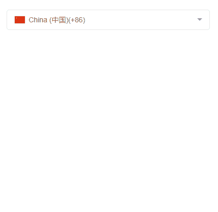

# 1、vue3-country-intl
Mobile phone area code and nationality components based on vue3, compatible with PC and mobile terminals. `vue3-country-intl` has 3 modes (
input, popover, modal)

Plugin supported country data from:
+ iso2 code: https://en.wikipedia.org/wiki/ISO_3166-1_alpha-2
+ country code: https://en.wikipedia.org/wiki/List_of_country_calling_codes

## 1.1、Effect preview
[https://941477276.github.io/vue3-country-intl/dist/](https://941477276.github.io/vue3-country-intl/dist/)


## fellow apprentices
>Vue2.0 of the nationality / mobile phone area code selection plug-in (`vue-country-intl`)
+ [vue-country-intl](https://github.com/941477276/vue-country-intl)
>React of nationality/mobile phone area code selection plug-in(`reaxt-country-intl`)
+ [react-country-intl](https://github.com/941477276/react-country-intl)
>Nationality/mobile phone area code selection plug-in for WeChat Mini Program(`wx-country-intl`)
+ [wx-country-intl](https://github.com/941477276/wx-country-intl)
>he most basic drop-down component that can be positioned intelligently(`easyest-dropdown`)
+ [easyest-dropdown](https://github.com/941477276/easyest-dropdown)

## 1.2、Install
`npm install vue3-country-intl --save`

[中文文档](./README-CN.md)

## 1.3、Usage --.vue single file
```
/*****main.js****/
import Vue from 'vue';
import App from './App.vue';
import Vue3CountryIntl from 'vue3-country-intl';
// import css
import 'vue3-country-intl/lib/vue3-country-intl.css'


const app = Vue.createApp(App);
// Globally registered components
app.component(Vue3CountryIntl.name, Vue3CountryIntl);

/*****used in the component****/
<template>
    <vue3-country-intl v-model="countryCode"></vue3-country-intl>
</template>
```

## 1.4、Usage - import js files directly
```
<link rel="stylesheet" href="./lib/vue3-country-intl.css">
<script src="./lib/vue3-country-intl.esm.min.js"></script>
<script>
  Vue.component('vue3-country-intl', vue3CountryIntl);
  new Vue({
    el: '#app',
    data: {}
  });  
```

## 1.5、schema=input(default)
```
<template>
    <Vue3CountryIntl v-model="phoneCountry"></Vue3CountryIntl>
</template>    
```
Effect:




Use Chinese to display nationality names


## 1.6、schema=popover(popover)
```
<template>
    <Vue3CountryIntl
        schema="popover"
        elId="my_reference"
        v-model="schemaPopoverData.default"
        v-model:visible="schemaPopoverData.visible">
    <button type="button" @click="schemaPopoverData.visible = true">选择手机区号</button>
    </Vue3CountryIntl>
</template>    
```
```
<template>
    <Vue3CountryIntl
        schema="popover"
        popover-class="popover-class1111"
        v-model="schemaPopoverData.default"
        v-model:visible="schemaPopoverData.visible">
        <button type="button" @click="schemaPopoverData.visible = true">选择手机区号</button>
        <template slot="vueCountryNoData"><h1>没有找到该国籍！</h1></template>
    </Vue3CountryIntl>
</template>    
```
Effect:


## 1.7、schema=modal(Modal)
```
<template>
  <button type="button" @click="schemaModalVisible.default = true">选择手机区号</button>
  <Vue3CountryIntl schema="modal" modal-class="modal-class" :listZIndex="5000" v-model:visible="schemaModalVisible.default" v-model="schemaModal.default">
    <template slot="vueCountryNoData"><h1>没有找到该国籍！</h1></template>
  </Vue3CountryIntl>
</template>    
```
Effect:


## 1.8、props
1.`schema`: display mode

+ input: input input box mode (default)
+ popover: popover popup window mode
+ modal: modal box popup window mode

2.`type`: value type

+ phone: Indicates to select the mobile phone area code
+ country: Indicates the choice of nationality

3.`placeholder`: input placeholder

4.`searchAble`: Is it possible to search (data type: Boolean)

5.`disabled`: is disabled（data type：Boolean）

6.`showAreaCode`: Whether to display the area code in the input box（data type：Boolean）


7. `showLabelImg`: Whether to display images in the input box (data type: Boolean)

8. `onlyValue`: Whether to display only the selected value, but not the international name (data type: Boolean)

9. `listZIndex`: The hierarchy of the list (data type: Number)

10. `maxHeight`: The maximum height of the list, the default is 350px for PC, and 240px for mobile (data type: Number)

11. `selectedText`: the text on the right side of the selected item in the list, the default is Selected

12. `showSelectedText`: Whether to display the right 'Selected' text when the list item is selected, the default is true (data type: Boolean)

13. `readonly`: whether to read only, default `false` (data type: Boolean)

14. `offsetTop`: The distance between the popover window and the reference element. The default is 10. Only valid when `schema=popover` (data type: Number)

15. `popoverClass`: extra class for popover pop-up window. Only valid when `schema=popover` (data type: String)

16. `searchInputPlaceholder`: Search the placeholder text of the input box, only valid in schema=popover, schema=modal (data type: String)

17.`modalClass`: extra class for model pop-up window. Only valid when `schema=modal` (data type: String)

18: `visible`: control component display and hide, only valid in `schema=modal`, `schema=popover` modes (data type: Boolean)

19: `cancelText`: the text of the button to close the popup window, default: 'cancel', only valid in schema=modal mode (data type: String)

20: `disableCountry`: Disabled countries (country name, country code, country area code can be passed), strings or arrays can be passed, when passing strings, disable multiple countries separated by commas (data type: String|Array)

21: `onlyCountry`: Only display the specified country. You can pass a string or an array. When passing a string, multiple countries are separated by commas (data type: String|Array)

22: `noDataText`: The text displayed when no country data is found, if there is a `vueCountryNoData` slot, the slot content will be displayed first (data type: String)

23: `iosMobileReadonly`: Whether the input box of the ios mobile terminal is read-only (only valid in `schema=input` mode), the default is true, because if the ios mobile terminal is not in the read-only mode, the selection box will pop up (data Type: Boolean)

24: `useChinese`: Whether to display the nationality name in Chinese, the default is `true` (data type: Boolean)

25: `static`: Whether to use static layout (static layout) (only valid in `schema=input` mode), the default is `false` (data type: Boolean)

26: `transitionName`: transition name, you can customize the transition effect when the component is displayed/hidden. Default is `''` (data type: string)

26: `offset`: The distance between the popover window and the click area (only valid in `schema=popover` mode). Default: `[0, 10]` (data type: Array)

27: `rightOffset`: The distance between the popover window and the right side of the browser, this value is only valid in small screens (only valid in `schema=popover` mode). Default: `20` (data type: Number)

28: `iso2`: It is best to pass this attribute when `type=phone`, to avoid the problem of incorrect echo when the area codes are 212, 358, and 1, because these area codes are used by multiple countries

29: `appendToBody`: Whether to insert the list into the body. Defaults to `true` (data type: Boolean)

30: `filter`: Sorting function, consistent with the callback function in `Array.filter`. Default is `null` (data type: Function) `new in 2.0.2`

31: `sort`: Sorting function, consistent with the callback function in `Array.sort`. Default is `null` (data type: Function) `new in 2.0.2`

32: `transform`: Data processing function, you can use this function to deeply customize the data list, such as sorting, filtering, pinning, etc. The return value is a list of processed pairs. Default is `null` (data type: Function) `new in 2.0.3`

33: `clearable`: Whether it can be cleared. If the value is `true`, the clear button will be displayed. The default value is `false` (data type: Boolean) `New in 2.0.7`

## 1.9、可用方法(method)
1. `show`: show list

2. `hide`: hide list

3. `getSelected`: Get the selected list item

3. `getCountryInfo`: Look up nationality information based on nationality code or country code

| parameter name | description | default value |
|:------|:-----|:------|
| countryCodeOrAreaCode | Nationality Code or Nationality Area Code | `''` |
| type | value type | `phone` |
| iso2 | Nationality code | `''` |


## 1.10、slot
1. ~~`vueCountryNoData`：The slot displayed when no country data is found (removed after version 2.x)~~


1. `noData`: empty data slot
2. `countryItem`: custom list item slot
3. `selected`: custom selected text slot
4. `emptyData`: empty data slot
5. `customInputLabel`：The contents of the input box, is only valid if `schema=input`
6. `clear`: Clear the button slot on the right side of the input box. Only valid when `schema=input`

## 1.11. Events
1. ~~`onChange`: Triggered when the user manually selects a list item, and will pass selected and value to onChange (removed after version 2.x)~~


1. `change`: event when the user manually selects a list item, callback parameter: `function (country)`


# 2, vue3-country-flag
A national flag flag component based on vue3

## Effect preview


## 2.1、Install
`npm install vue-country-intl --save`

## 2.2、Usage
> Step 1: Install a plugin that supports using require.context() to import files in vite
> 
> `npm install @originjs/vite-plugin-require-context -D`

**vite.config.js**
```
import ViteRequireContext from '@originjs/vite-plugin-require-context';
export default {
    plugins: [
        ViteRequireContext(),
        ...
    ]
}
```

**main.js**
```
import { createApp } from 'vue'
import Vue3CountryFlag from 'vue3-country-intl/lib/vue3-country-flag.esm.min.js';
// 引入css
import 'vue3-country-intl/lib/vue3-country-flag.css'

const app = createApp(..);
// import svg icons
let flagFilePath = require.context('vue3-country-intl/lib/country-flag-svgs', true, /\.svg$/);
app.use(VueCountryFlag, flagFilePath);

// import svg icons use vite
// let flagFilePath = import.meta.glob('vue3-country-intl/lib/country-flag-svgs/*.svg', { eager: true });
// app.use(VueCountryFlag, flagFilePath);
```

**Use in component**
```
<template>
    <Vue3CountryFlag value="cn"></Vue3CountryFlag>
    <Vue3CountryFlag value="+86">
      <template v-slot="{country}">
        <span class="slot-span">Country：<mark>{{country.name}}</mark></span>
      </template>
    </Vue3CountryFlag>
</template>
```
## 2.3, props attribute
1. `value`: nationality code or mobile phone area code value

2. `type`: value type

+ phone: Indicates to select the mobile phone area code
+ country: Indicates the choice of nationality

3. `iso2`: nationality code, when type=phone must pass the iso2 attribute, otherwise there will be problems when the area code is 212 or 358!

4. `useTitle`: Whether to add `title` attribute to the element, the value of title is the code of nationality or mobile phone area code (data type: Boolean)

## 2.4, available method (method)
1. `getCountry`: get detailed nationality information

## 2.5 Events
1. `click`: click event
